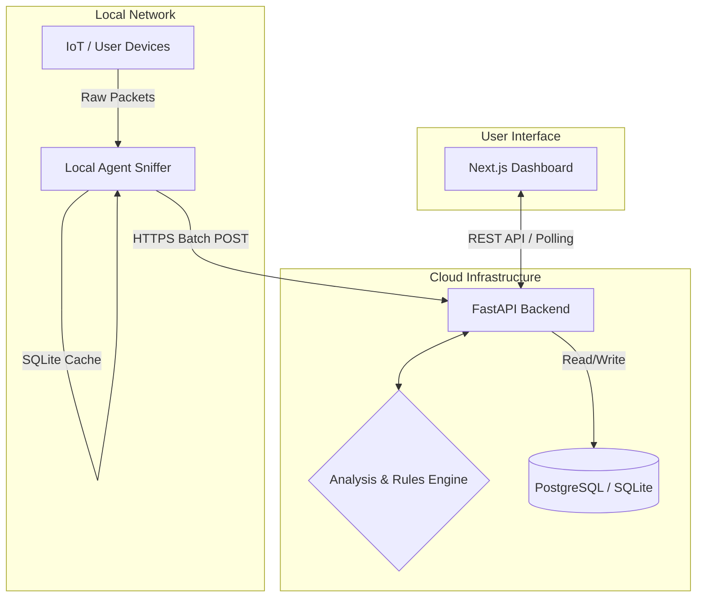
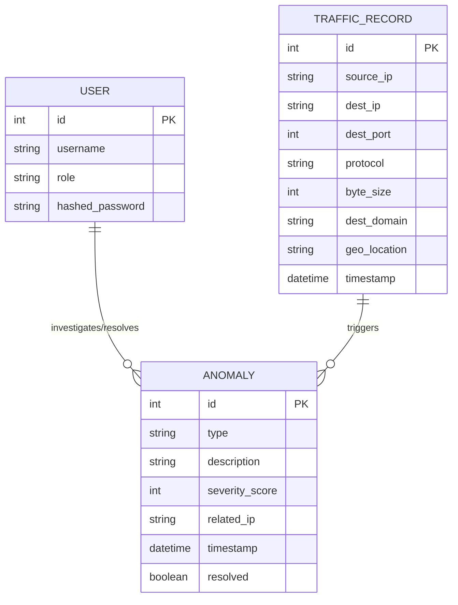

<div align="center">
  <h1>🛡️ NetSentinel</h1>
  <p><b>Comprehensive Network Security & Data Leak Prevention (DLP) Platform</b></p>
  
  [](https://python.org)
  [](https://nextjs.org/)
  [](https://fastapi.tiangolo.com/)
  [](https://opensource.org/licenses/MIT)
</div>

---

NetSentinel is an advanced, privacy-first network monitoring system designed to provide real-time visibility into your local network traffic. It detects anomalies, analyzes packets for potential data leaks, and delivers actionable insights through a centralized, high-performance dashboard.

## ✨ Key Features

- **Real-Time Deep Packet Inspection (DPI):** Monitor network activity at the granular packet level.
- **Automated Anomaly Detection:** Instantly identify suspicious traffic patterns, data exfiltration, or unusual bandwidth spikes.
- **DNS & Geo-IP Analysis:** Track domain resolution and map traffic destinations to flag foreign or malicious endpoints.
- **Persistent Local Queuing:** Reliable SQLite-backed data buffering ensures zero data loss during cloud sync interruptions.
- **Centralized Security Dashboard:** A modern Next.js interface featuring real-time charts (Recharts) and live traffic tables.
- **Role-Based Access Control (RBAC):** Secure, JWT-authenticated API endpoints and user management.

## 🏗️ System Architecture

NetSentinel utilizes a decoupled, three-tier architecture:



1. **[Cloud Backend](./backend-cloud):** A high-performance FastAPI server managing data persistence, rules-engine evaluation, and authentication.
2. **[Local Agent](./backend-local-agent):** A lightweight Python service using **Scapy** for hardware-level packet sniffing and secure, buffered transmissions to the cloud.
3. **[Frontend Dashboard](./frontend):** A responsive **Next.js 16** application for intuitive data visualization and security oversight.

### 📂 Project Structure

```text
📦 NetSentinel
├── 📂 backend-cloud/        # FastAPI Server, Rules Engine, DB Models, Auth
├── 📂 backend-local-agent/  # Scapy Sniffer, Local SQLite Buffer Queue
├── 📂 frontend/             # Next.js 16 Dashboard, Tailwind CSS, Recharts
├── 📄 docker-compose.yml    # Multi-container orchestration config
├── 📄 NetSentinel_Documentation.md # Deep dive architecture & logic
└── 📄 README.md             # Project overview and run instructions
```

## 🗄️ Database Entity-Relationship

The Cloud Backend persists critical metadata to drive the detection engines and frontend interfaces:



## 🛠️ Technology Stack

| Component | Technologies |
| :--- | :--- |
| **Cloud Backend** | FastAPI, Python, SQLAlchemy, PostgreSQL / SQLite, JWT, Bcrypt, APScheduler |
| **Local Agent** | Python 3.x, Scapy, WebSockets, REST APIs, SQLite (Local Buffer) |
| **Frontend** | Next.js 16 (App Router), Tailwind CSS 4, Shadcn UI, Zustand, React Query, Recharts |

## 🚀 Getting Started

The easiest way to deploy the NetSentinel Cloud and Frontend environments is via Docker Compose.

### 1. Start the Full Stack (Cloud & Dashboard)

Ensure you have [Docker](https://docs.docker.com/get-docker/) and Docker Compose installed.

```bash
# Clone the repository
git clone https://github.com/MatrixVoyage/Data-Leak-Monitor.git
cd Data-Leak-Monitor

# Build and spin up the environment
docker-compose up --build -d
```

- **Frontend Dashboard:** [http://localhost:3000](http://localhost:3000)
- **Backend API:** [http://localhost:8000](http://localhost:8000)

### 2. First-Run Setup & Authentication

1. Open [http://localhost:3000](http://localhost:3000) in your browser.
2. Follow the **Setup Wizard** to create your primary Administrator account.
3. Copy and securely store the **Agent API Key** generated at the end of the wizard. *(You can retrieve/regenerate this key anytime from **Settings > Agent & Alerts**).*

### 3. Deploy the Local Agent

The local agent must run on the machine or network gateway you intend to monitor. It requires administrative/root privileges to capture raw network packets.

```bash
cd backend-local-agent

# Create environment configuration
echo "CLOUD_API_URL=http://localhost:8000" > .env
echo "AGENT_API_KEY=your_generated_api_key_here" >> .env

# Install dependencies
pip install -r requirements.txt
```

**Run the Agent:**
- **Windows:** Open an Administrator terminal and run `python main.py`.
- **Linux/macOS:** Run `sudo python main.py`.

*(Optional) Dockerized Agent for Linux (requires host networking):*
```bash
docker build -t netsentinel-agent .
docker run -d --network host --privileged   -e CLOUD_API_URL="http://localhost:8000"   -e AGENT_API_KEY="your_generated_api_key"   netsentinel-agent
```

## ⚠️ Security Notice

NetSentinel performs raw network packet capture. It is intended strictly for authorized network monitoring, privacy auditing, and security research. Always ensure you have explicit permission to monitor traffic on your target network.
